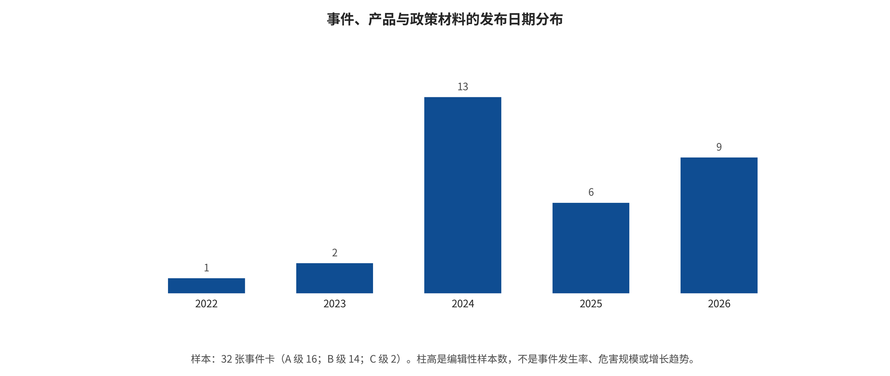

## 附录 C. 32张事件卡、新闻与政策时间线

### APP-C.E1 证据展开：新闻、真实事件、产品安全与政策时间线

#### APP-C.E1.1 编码规则：事件日期不等于报道日期，归因不等于发生率

本章完整覆盖中央事件卡E001–E032，每个事件只计一次；多篇报道作为来源链，不新增事件。事件日期描述行为、生效或产品变更发生的时间，发布日期描述证据文件出现时间。五段证据链分别是：生成/编辑是否被一手材料确认；内容如何进入传播或业务流程；可观察后果是什么；现实伤害是否有独立证据；官方、司法或平台如何响应。任何未知环节都保留为未知，不能用常识补齐。

证据A级主要指法规正文、法院/司法记录、政府书面答复和可核验标准；B级多为供应商、平台或机构自报，能证明“该组织作了何种声明或动作”，但独立性有限；C级为高信誉媒体交叉，通常只能支撑事件存在和公开反应，不能确定具体生成器、攻击者或传播总量。报道密集反映媒体选择、司法公开度和平台透明度，不是攻击发生率。`event_timeline.csv`逐项保存生成证据、传播、后果、官方响应、未知项和来源ID。

#### APP-C.E1.2 身份冒充、诈骗与政治传播簇（E001–E003、E007、E011–E012、E025）

**E001 香港约2亿港元深伪视频会议诈骗。** 生成证据来自香港政府LCQ9书面答复：公开网络视频和声音被下载，预录深伪会议用于冒充管理层。传播链不是公开社交传播，而是组织内部会议和转账授权；可观察后果是员工向5个本地账户转出约2亿港元。现实财产损失由政府答复确认，官方响应包括警方调查、账户追踪、金融机构协作和反诈骗宣传。未知项包括会议是否实时生成、具体模型、每笔追回金额和攻击者技术栈。[@O048] [@O049]

**E002 香港近400万港元CFO冒充案。** 官方答复确认2024-05-20左右，员工经即时消息进入冒充CFO的视频会议并转账。与E001相同，它证明身份与业务授权流程被攻破，不证明某种T2V模型具有特定ASR。现实后果是近400万港元损失；案件调查状态以2024-06-26答复为限。实时性、生成器和追回情况仍未知。[@O048] [@O049]

**E003 冒用香港行政长官形象和声音的虚假投资广告。** 政府公告确认广告为虚假并公开否认背书。生成/编辑方法、发布者和传播规模未披露，因而只能确认身份/授权状态失真及诈骗暴露风险，不能确认损失。官方响应是澄清与公众提醒，执法进展未知。[@O050]

**E007 五角大楼附近虚假爆炸图像。** 权威机构澄清没有发生相应爆炸，媒体记录到图像传播和短暂市场波动；“由AI生成”的技术归因仍应写作疑似或可能，而不能从画面外观反推。传播发生在社交平台和新闻聚合链，现实因果损失无法从短暂市场波动单独识别；攻击者、工具、初始账户和获利均未知。[@O070] [@O074] [@O075]

**E011 台湾选举影响行动。** 微软威胁分析报告称影响行动在2024年台湾选举相关内容中使用AI生成元素。该来源是机构威胁情报，可支撑其观察和归因判断，但不等于公开司法认定。传播链涉及社交内容与政治叙事，现实投票影响缺乏反事实证据；生成比例、具体模型和受众行为效应未知。[@O063] [@O064]

**E012 乌克兰战争相关伪造投降视频与冒用网络。** Meta公开处置材料确认平台移除伪造投降视频和相关冒用网络。这里的平台日志可证明内容存在与处置动作，但不能独立证明制作工具、国家行为归因或现实战略效果。官方/平台响应是删除、账户网络处置和公开披露；跨平台再上传情况未知。[@O065] [@O066]

**E025 虚拟绑架中的存活证明照片和视频。** FBI警告犯罪者会修改照片或视频用于虚拟绑架勒索。官方警告能证明执法部门观察到该作案模式，不能给出全体案件发生率。传播链是攻击者向家庭发送“存活证明”并施压转账；个案损失、生成器、真假材料混合比例和受害规模未在本事件卡中给出。[@O062]

按本文编码，这七个主题性案例的主要失效集中在I7的身份与授权流程；这一分布来自有目的的事件选择，不能代表现实总体。案例显示，生成技术之外，账户控制、组织流程、平台推荐和受众判断也参与了转账、传播或政治影响链。因此该类场景的防御不能只部署深伪检测器，还应评估回拨核验、双人授权、独立支付渠道、账户异常检测、平台溯源和事件响应。

#### APP-C.E1.3 产品对齐、暂停恢复与生命周期簇（E004–E005、E031–E032）

**E004 Google暂停Gemini人物图像生成。** 供应商确认人物生成产生不准确或冒犯性历史/人物表示，随后暂停能力。生成证据强于媒体猜测，因为产品方确认了自身系统和动作；但原因解释、数据和评测集由供应商自报，缺独立复现。可观察后果是服务可用性下降和表示性争议，不能写成外部攻击成功。[@O046]

**E005 以Imagen 3分阶段恢复人物生成。** Google宣布改进数据、安全过滤与红队后向部分用户恢复。该事件是E004的产品响应续篇：能证明恢复和限制声明，不能证明独立安全有效性。地区、套餐与模型版本动态变化，部署效果需持续外部测量。[@O047] [@O046]

**E031 Sora Web/App产品面显示2026-04-26起不再可用。** 官方帮助页区分产品面：Web/App 的停用节点为2026-04-26，API另有计划节点（页面列为2026-09-24）；这两个日期都不能自动解释为模型权重或全部Sora能力同日终止。页面没有说明下线源于安全问题，因此不能把“停止服务”编码为防御成功或事故响应。相关系统卡只能描述供应商在特定版本上声明的红队、人物和误导内容缓解。[@O021] [@O019] [@R-A035]

**E032 Stable Video Diffusion托管API于2025-07-24停用。** Stability AI公告支持托管接口生命周期，不能推导模型撤回；自托管权重与代码路径仍可能存在。对安全研究而言，应区分服务版本终止、权重仍可下载和生态继续使用三种状态。[@O033] [@O032] [@O079]

这一簇防止一种常见因果错误：产品暂停、恢复或退役是可观察组织行为，但原因必须由来源明确。供应商模型卡和公告适合证明政策、能力范围与自报缓解，不适合证明现实平台长期效果。

#### APP-C.E1.4 训练语料与模型供应链事件簇（E008–E010）

**E008 LAION暂停LAION-5B下载。** LAION机构声明在外部研究指出疑似CSAM链接风险后暂停索引下载并开展安全审查。这里的资产是URL/元数据索引及其下游训练使用，不应写成LAION服务器存储全部底层图像。传播后果是数据集可用性中断和下游合规风险；底层内容取证、受影响链接比例和既有副本去向仍不完整。[@O051] [@O076]

**E009 Re-LAION-5B发布。** 机构于2024-08-30发布经修订、重新过滤的版本，作为E008的响应。官方声明可证明重建和过滤流程被执行，但不能证明零漏检或所有镜像更新。真正的治理问题是旧索引副本、模型已训练状态和持续撤回，而不是新文件是否存在。[@O052] [@O051] [@O076]

**E010 Hugging Face披露2026年7月模型评估安全事件。** 平台安全通告确认评估/模型生态中的安全事件和响应；具体漏洞、受影响制品、执行链和修复范围以原公告为限。本文把它作为跨模态评估基础设施的桥接事件：它直接支持远程加载与评估环境需要隔离、最小权限和事件响应，不能单独证明安全序列化或模型扫描的普适效果，也不能据一次披露估计仓库总体恶意率。安全格式与扫描建议另由第14章的官方安全文档支撑。[@O053] [@O054]

这三项事件将I1/I2从论文威胁模型连接到真实维护动作：数据集事件直接涉及停用、重建、版本与撤回，模型评估事件直接涉及隔离、最小权限与响应；扫描和安全格式是结合第14章官方文档提出的纵深防御，而非由E010单独推出。任何“已修复”声明都应附版本、时间和旧副本处置范围。

#### APP-C.E1.5 非自愿亲密影像、儿童安全与执法簇（E006、E018–E024）

**E006 Taylor Swift非自愿露骨合成图像传播。** AP与Reuters等高信誉媒体确认内容广泛传播及平台/政府公开回应，但没有可得的一手案件卷宗。因此生成器、攻击者、精确传播量和因果伤害不应补写；可确认的是未经同意的身份表征进入平台传播并引发处置讨论。证据等级为C。[@O071] [@O072] [@O073]

**E018 TAKE IT DOWN Act成为联邦法律。** 2025-05-19签署的Public Law 119-12建立非自愿亲密图像和digital forgery的刑事条款与平台有效通知后移除义务。它是制度节点，不证明此前或此后事件数量；研究应测量通知有效性、48小时流程、重复内容和申诉。[@O014] [@O015]

**E019 全国首宗相关认罪。** DOJ于2026-04-07称一名被告就包括digital forgeries在内的罪名认罪，并称为全国首例TAKE IT DOWN Act定罪相关案件。司法状态是认罪，不应与指控混淆；案件同时含真实和AI材料、网络跟踪和其他罪名，不能把全部伤害归给生成模型。[@O055]

**E020 两人被捕并被控发布AI深伪色情。** 2026-05-20刑事控告指称两名被告发布大量涉及可识别女性的图像/视频。发布量和浏览量属于控告材料，案件仍适用无罪推定；当前证据证明司法程序和指控事实，不是最终定罪。[@O056]

**E021 域名扣押。** DOJ与DHS于2026-06-12扣押被指用于发布非自愿数字伪造内容的域名，并说明法官认定存在支持扣押令的probable cause。域名扣押、法国逮捕和未来刑事责任是不同程序状态；它证明跨境执法与基础设施处置，不证明所有站内内容由同一模型生成。[@O057]

**E022 AI生成裸照相关网络跟踪起诉。** 2026-06-18美国司法材料描述联邦大陪审团起诉网络跟踪，指称使用AI生成裸照和伪造账户放大骚扰。起诉只是指控，当前罪名并不等于TAKE IT DOWN Act定罪。现实后果是被指控的持续骚扰和身份攻击，具体生成器未知。[@O058]

**E023 含AI生成CSAM的混合儿童剥削案件有罪裁决。** 2026-02-06 DOJ宣布陪审团对接收、持有真实与AI生成儿童性虐待材料等罪名作出有罪裁决。该案材料确认使用文本到图像程序生成部分内容；同时存在真实受害材料，故不得把混合罪行全部归因AI。[@O059]

**E024 NCMEC关于生成式AI儿童剥削举报。** 2024-12-13页面称此前两年收到超过7000条相关举报。举报条目不等于独立事件、受害者或司法确认样本，且报告表单与分类随时间变化。NCMEC截至2026-08-09的更新页面进一步列出2023–2025分类统计，并明确并非所有带AI关联的报告都涉及生成或分享GAI CSAM；因此最新数字只能按官方口径分别引用，绝不能拼成发生率趋势。[@O060] [@L-S005]

#### APP-C.E1.6 标识、来源证明与平台执行簇（E013–E017、E028–E030）

**E013 Meta承认误标真实照片。** Meta说明其事实核查/标记系统曾把经过普通编辑的真实照片错误标成AI相关内容。它提供一个重要反例：更积极的标签不必然更安全，误报会损害真实内容信誉。该事件可核验的是平台承认标签误用；它不是已证实的生成事件，生成器字段为`NA/未证实`。官方响应是调整标签和解释机制。[@O080] [@O042]

**E014 中国标识办法与GB 45438-2025施行。** 2025-09-01起，《人工智能生成合成内容标识办法》和强制性国家标准同步实施，区分用户可感知的显式标识与文件元数据中的隐式标识，并对生成服务和内容传播服务分配责任。法规禁止恶意删除、篡改、伪造或隐匿标识；但跨平台保留、误报和申诉仍需实证。[@O009] [@O012] [@O010] [@O011]

**E015 中国网信部门公布应用处置。** 2025-11-25监管公告列出一批生成合成内容标识违法违规应用的处置。该证据能确认执法动作和被点名应用，不应除以应用总数估计违规率，因为筛查框架、覆盖和抽样分母未公开。[@O013] [@O009]

**E016 欧盟AI Act Article 50义务开始适用。** Regulation (EU) 2024/1689的相关透明度义务自2026-08-02适用，分别涉及提供者的机器可读标记/检测与部署者对深度伪造等内容的披露；欧委会问答同时说明，此前投放市场的相关系统存在至2026-12-02的过渡安排，具体适用对象、例外和解释仍应回到正式法源。法律义务、过渡期与技术有效性是三层证据。[@O006] [@O007] [@O008]

**E017 欧委会最终实践准则。** 2026-06-10公布的最终准则帮助提供者和部署者实施Article 50(2)、(4)、(5)，网页在2026-07-29更新并链接统一图标与签署流程。该准则是自愿工具；签署、遵循或欧委会充分性意见都不是决定性的合规证明，更不等于平台转码后标记100%保留。[@O007] [@O008] [@O007]

**E028 C2PA合规计划与Trust List启动。** 2025年中期，C2PA正式信任列表和合规生态进入运行阶段；技术规范2.4定义manifest、签名、验证、撤销和信任锚。事件日期在中央卡中为NR，因而只写启动窗口，不虚构单日。证书受信证明签名链，不能证明声明语义真实。[@O003] [@O004] [@O001] [@O002]

**E029 TikTok读取Content Credentials自动标注。** TikTok于2024-05-09宣布读取C2PA Content Credentials，对外部生成的图像和视频自动标注。这是平台部署声明，能够证明产品计划和信号接口；真实上传下载链的保留率、错误标签和覆盖仍需独立评测。[@O045] [@O001] [@O077]

**E030 YouTube强化AI标签。** YouTube于2026-05-27宣布把AI标签移至更显著位置并引入自动识别信号。它说明平台从用户自报向多信号执行扩展；用户理解、不同语言呈现、误报、申诉和重复上传结果尚未由该公告证明。[@O044] [@O043] [@O001]

这一簇形成“模型标记—文件凭证—平台读取—用户展示—处置申诉”的链。任一节点丢失都会中断对应的凭证路径或降低覆盖，但冗余水印、软绑定和平台日志可能保留其他线索，不能笼统写成覆盖归零；反之，链条完整也只表明来源声明可验证，不表明媒体表达的事件真实。

#### APP-C.E1.7 版权与诉讼边界簇（E026–E027）

**E026 Andersen v. Stability AI阶段性裁定。** 截至2024-08-12这一程序节点，美国法院允许部分主张继续审理。程序性“允许继续”不是最终侵权或责任认定；它只能支持该日的诉讼状态、主张类型和下一步程序。生成模型训练是否复制、输出是否实质相似、各被告责任需按后续案卷分别判断。[@O067]

**E027 Getty Images v Stability AI英国判决。** 截至2025-11-04这一裁判节点，英国高等法院发布`[2025] EWHC 2863 (Ch)`判决。正式判决可支撑该案裁判结论和法律分析，但不能直接转化为任意模型或司法辖区的技术安全规则；训练地、权重、输出、商标与版权主张应分开。[@O069] [@O068]

两项诉讼说明技术论文的“相似度”“记忆”或“训练使用”不能自动等于法律侵权。综述应把论文观测、权利主张、程序阶段和最终裁判放在不同列，避免把实验指标用作法律结论的替代品。

#### APP-C.E1.8 跨事件综合：能证明什么，仍然不知道什么

当前32项材料能够覆盖多种证据接口，但这种覆盖不构成时间增长趋势：政府书面答复能确认财产损失和调查；供应商公告能确认产品动作；司法记录能区分起诉、认罪、裁决与扣押；法规和标准能定义义务；平台公告能确认标签功能；媒体只能在缺少一手卷宗时提供受限交叉。不同类型来源彼此补充，不能替代。

**表：事件主题簇与证据上限**

| 主题簇 | 纳入事件卡数 | 事件日期跨度 | 证据等级构成 | 响应示例 |
|---|---|---|---|---|
| 产品对齐、暂停恢复与生命周期 | 4 | 2024-02-22 至 2026-04-26 | B:4 | Google 道歉、解释调优问题并暂停能力以改进 |
| 标识、来源证明与平台执行 | 8 | 2024-05-09 至 2026-08-02 | A:5、B:3 | Meta 调查并修正错误匹配 |
| 版权与诉讼边界 | 2 | 2024-08-12 至 2025-11-NR | A:1、B:1 | 法院发布书面裁定 |
| 训练语料与模型供应链事件 | 3 | 2023-12-19 至 2026-07-NR | B:3 | LAION 启动维护、安全审查与后续清理 |
| 身份冒充、诈骗与政治传播 | 7 | 2022-03-NR 至 2025-NR-NR | A:4、B:2、C:1 | 警方调查、宣传教育和金融机构协作；后续统计口径见 2026 年预算答复 |
| 非自愿亲密影像、儿童安全与执法 | 8 | 2024-01-24 至 2026-06-18 | A:6、B:1、C:1 | 白宫公开表达担忧；平台采取部分搜索和内容措施 |

注：数据源为 `paper/tables/event_clusters.csv`；正文显示 6/6 行并对过长单元格作省略，完整字段与记录以该 CSV 为准。

---

[← 返回目录](index.md)
