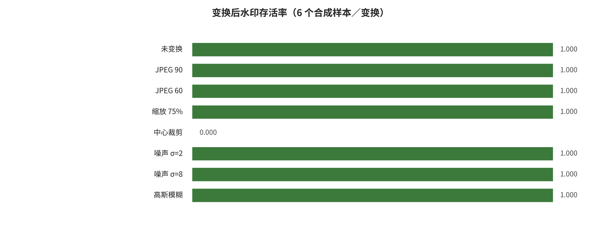

## 附录 D. 局部实验、七仓库静态审计与构建回执

### APP-D.E1 证据展开：有边界的局部实验与七仓库静态审计

#### APP-D.E1.1 复现问题不是“能否跑出一个数字”

复现章节统一使用六状态枚举：`NOT_ATTEMPTED` 表示未运行；`STATIC_AUDIT_ONLY` 只读代码、配置和制品合同；`ENVIRONMENT_PROBE` 验证环境或入口；`PARTIAL_RUN` 运行无害的局部子问题；`CONTROLLED_END_TO_END` 在授权数据和隔离模型上完成主协议；`EXTERNAL_SERVICE_VALIDATION` 还要求服务授权、版本与请求证据。它们不能互相升级，另设 `paper_main_protocol_run` 布尔量说明是否运行论文主配置。当前环境探针通过，合成媒体水印实验为 `PARTIAL_RUN`，七个仓库为 `STATIC_AUDIT_ONLY`，41 张论文卡为 `NOT_ATTEMPTED`，`end_to_end_runs=0`。

局部实验选择真实性防御，是因为它可以使用完全合成的图像和视频、安全地考察不同信号在媒体变换下的行为，并保留精确分母。实验不使用生成模型权重，不声称复现 Stable Signature、Tree-Ring、VideoSeal、C2PA 或任何产品水印。它只回答：测试用精确字节校验、易剥离容器元数据和一个全局 DCT-QIM 玩具信号，在预注册变换下分别表现怎样。

#### APP-D.E1.2 环境、输入与状态合同

环境记录操作系统、Python、FFmpeg、图像库与散列工具版本；实验配置、依赖和运行日志位于 `reproductions/`。图像输入为 6 个程序生成的合成样本，不含个人数据或版权素材；视频输入由 48 个合成源帧组成。所有输出、摘要、精确签名和验证报告具有文件散列。

实验状态写 `PARTIAL_RUN`，原因不是程序失败，而是研究目标有意局部：没有运行任何论文模型、没有学习水印编码器/解码器、没有攻击真实服务，也没有覆盖密钥管理、公开验证、撤销、跨平台上传或受害者处置。验证报告只证明当前文件、分母和状态合同自洽。

#### APP-D.E1.3 三类真实性合同

第一类是精确字节 SHA-256/HMAC。它验证对象字节是否完全一致，适合不可变文件传输；任何重编码、重封装或元数据变化都会改变结果。测试用 HMAC 说明“持有共享密钥的一方可对精确字节计算认证码”，不是公开可验证签名，也没有证书、时间戳和撤销。

第二类是容器元数据。元数据可以记录来源线索，但是否保留取决于处理链是否复制。实验中显式剥离后即消失，说明“存在元数据”与“媒体内容本身具有鲁棒信号”不同。第三类是内容级 DCT-QIM 玩具信号，它在若干压缩和噪声下仍可检测，却在裁剪和较强视频压缩下明显失败。三类实际测试对象可以互补：精确字节保证不可变对象，普通元数据提供易失线索，内容信号在容器字段丢失时提供有限恢复线索。密码学来源清单、签名声明和编辑链是本文讨论但未在本地运行的概念性第四层，不属于上述三项实验，也不能由普通元数据结果推断。

#### APP-D.E1.4 图像实验、分母与结果

图像组对 6 个水印样本和 6 个干净对照施加 8 类处理。每个处理的有效分母分别为 6 个水印样本和 6 个干净样本。JPEG Q60、缩放、两级噪声和高斯模糊在当前阈值下均为 6/6 检出，中心 80% 裁剪后缩放为 0/6。结果说明全局固定频带信号对当前裁剪实现不具同步恢复能力，而不是“所有频域水印都不抗裁剪”；逐变换分子、分母见 `reproductions/results/image_summary.csv`，实验总状态见 `reproductions/results/summary.json`。

实验同时记录干净样本误报，避免只报告水印样本命中。因为样本全部合成、数量很小、没有跨生成器或真实平台处理，本结果不支持总体鲁棒率、置信区间或产品比较。它的价值是展示同一检测阈值下，处理类型如何改变信号，以及为什么水印论文必须报告具体变换、分母和正常内容误报。

#### APP-D.E1.5 视频实验：源帧不等于每个处理分母

视频组从 48 个源帧构造 9 个处理条件。不同帧率处理会改变解码帧数，因此标题中的 48 个源帧不是每个条件的固定检测分母；全部条件合计为 420 个有效水印帧和 420 个有效干净帧。CRF23 重编码为 48/48 检出且无干净帧误报；CRF35 为 21/48，并出现 1/48 干净帧假阳性；250 kbit/s 为 18/48；中心裁剪为 0/48。逐帧与条件汇总分别见 `reproductions/results/video_frame_results.csv` 和 `reproductions/results/video_summary.csv`。

逐帧结果只支持帧级命题。生产视频还需要片段级检出、最长连续漏检、关键事件覆盖、首次告警时延、帧率变化、插帧/删帧、时序定位和流式资源。当前实验没有学习时序传播，也不具备 VideoSeal 所讨论的模型化时空编码 [@P033]。因此，图中 6 fps 条件的分母和视频级结论必须单独解释，不能把帧级平均写成整段来源已被可靠验证。

#### APP-D.E1.6 为什么结果不能成为论文排行榜

Stable Signature 在解码器中植入签名，Tree-Ring 在初始噪声频域构造可反演模式，VideoSeal 使用学习式图像编码与时序传播，而本实验是全局 DCT-QIM。它们的嵌入位置、密钥、感知约束、检测器、攻击预算和样本均不同 [@P028] [@P029] [@P033]。WAVES 说明水印比较需要统一压力测试，但本文没有把玩具信号加入其完整协议，也没有运行这些论文主配置 [@P030]。

所以本章可以用局部结果解释“为什么评测合同重要”，不能用它给方法排序。尤其是中心裁剪 0/6 不能写成对所有水印的反例，CRF23 48/48 也不能写成生产视频中的鲁棒性证明。外推需要至少跨多类真实视频、多个编码器、画质约束、未知处理链、低基率误报和自适应移除。

#### APP-D.E1.7 七个仓库的静态审计

仓库审计覆盖 Stable Signature、VideoSeal、Tree-Ring Watermarks、UnMarker、PhotoGuard、DeepfakeBench 和 c2pa-rs。每个快照记录官方仓库身份、固定提交、分支、源文件数量、入口、语法/编译探针、权重和数据合同、依赖文件、许可证与阻塞原因。`.git` 对象库不进入复现文件清单，但提交 SHA 单独保存。

静态审计能够回答“当前提交有哪些入口、需要哪些权重/数据、许可证是否存在、帮助命令或源文件能否解析”；它不能回答模型是否达到论文指标。未下载大型权重和数据、未建立各论文指定环境、未执行主配置，因此 7/7 均为 `STATIC_AUDIT_ONLY`，`end_to_end_runs=0`。逐仓库提交、入口和阻断原因见 `data/repo_audit.csv` 与 `reproductions/results/repo_audit.json`。即使某入口通过 `--help` 或源文件编译，也只说明入口合同局部成立。

#### APP-D.E1.8 复现升级路线

端到端升级应按风险和代表性分阶段进行。首先为每个仓库锁定论文版本、提交、权重、数据、配置、许可证和硬件；其次在隔离环境运行作者最小示例并保留失败；再次选定共同数据和变换进行统一重跑；最后才在满足独立研究和方差条件时考虑定量综合。水印研究需要把图像与视频、嵌入/检测/定位/归因、正常效用与适应性移除分开。

如果未来只完成导入、帮助命令或单样本可视化，状态仍不能写成论文复现。若权重不可访问、许可证不允许或运行会提高现实滥用能力，应保留 NOT_ATTEMPTED/阻塞说明，而不是用模拟数字补齐。

**表：七个仓库的静态审计状态**

| 仓库 | 类别 | 提交 | 状态 | 边界/阻断 |
|---|---|---|---|---|
| stable signature | 生成时水印防御 | c91217c06e95 | STATIC AUDIT ONLY、PASSED | main=false; runs=0; 未下载权重；未下载数据；未建立仓库指定隔离… |
| videoseal | 图像、视频水印防御与锻造攻击配套 | 870ca7fb3357 | STATIC AUDIT ONLY、PASSED | main=false; runs=0; 未下载权重；未下载数据；未建立仓库指定隔离… |
| tree ring watermark | 生成时语义水印防御 | 3015283d9cf8 | STATIC AUDIT ONLY、PASSED | main=false; runs=0; 未下载权重；未下载数据；未建立仓库指定隔离… |
| unmarker | 水印移除攻击 | 58ba69259dd1 | STATIC AUDIT ONLY、PASSED | main=false; runs=0; README 约 30GB 权重、数据包未… |
| photoguard | 输入免疫、编辑防御 | 686bea75c786 | STATIC AUDIT ONLY、PASSED | main=false; runs=0; Stable Diffusion、Hugg… |
| deepfakebench | 图像、视频伪造检测防御基准 | f188b1c10546 | STATIC AUDIT ONLY、PASSED | main=false; runs=0; 未下载权重；未下载数据；未建立仓库指定隔离… |

注：数据源为 `paper/tables/repo_audit_compact.csv`；正文显示 6/7 行并对过长单元格作省略，完整字段与记录以该 CSV 为准。

---

[← 返回目录](index.md)
