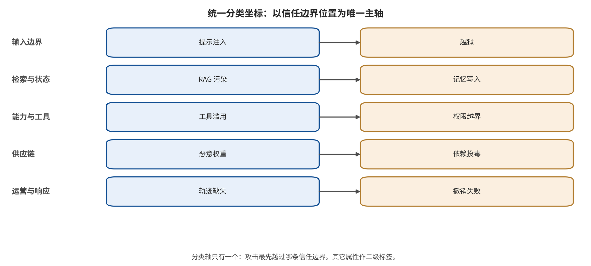

## 读者导航：正文结构与统一分类坐标

正文不是按公司或论文逐篇堆叠，而是沿着一条完整攻击链展开：不可信内容如何进入系统，在哪个信任边界获得影响，模型提出了什么动作，harness 为何放行，最终形成何种后果，以及哪一层控制能够切断链路。前五部分依次建立系统模型与研究方法，再给出攻击分类、共同根因和纵深防御；其目的，是先固定比较坐标，再进入具体论文。

第六部分用统一模板解析代表研究，第七部分还原事件与新闻，重点分析 2026 年 OpenAI 评测代理越界进入 Hugging Face 的攻防链。第八、九部分分别执行荟萃可合并性审计和研究级探索性相关；第十部分分析攻击自动化、长时代理、多模态状态、能力安全与形式化信息流；第十一部分把结论转为部署、运行和事故后的工程门禁。

为避免把名称相近但后果不同的工作混在一起，本文为每项研究或事件同时编码七个坐标。主分类采用“攻击入口 + 被破坏的边界 + 最终后果”；其余字段是交叉标签，不用来制造重复样本。完整关系绘制在下方分类图中，正文只解释其逻辑。

**入口坐标**回答恶意影响从哪里进入，取值包括用户提示、网页/邮件/PDF、RAG 记录、工具输出、记忆、图像/音频以及模型或依赖包。**边界坐标**回答哪一道信任边界失效，包括指令—数据、用户—租户、模型—执行器、身份—授权、容器—宿主、构建—运行和当前会话—长期状态。

**攻击者能力坐标**记录黑盒、灰盒或白盒访问，单轮或多轮预算，人工或自动化，以及攻击是否针对已知防御重新优化。**模态坐标**记录文本、图像、音频、视频、GUI、代码或跨模态组合，目的是保留解析器差异，而不是把“多模态”当成单一攻击。

**时间坐标**区分瞬时、会话内、跨会话、入库/入权重和供应链持久化。**结果坐标**严格区分内容违规、控制劫持、危险意图、危险执行、泄漏/破坏和可用性/费用损失。**防御位置坐标**则记录真正阻断链路的是模型/分类器、结构化上下文、来源/信息流、动作授权、记忆治理、沙盒/网络/秘密、供应链，还是监控与响应。

攻击族进一步归为八组：**模型行为绕过、上下文与控制流注入、检索与状态污染、工具与权限滥用、多模态解析攻击、隐私与知识产权攻击、模型/软件供应链攻击、可用性与经济攻击**。防御则归为四个纵深层次：**概率性模型防御、结构化控制与信息流、系统隔离与能力约束、运营治理与事件响应**。这种双层编码允许比较“同一攻击在不同系统边界上的后果”，也允许明确哪些百分比根本不能进入同一荟萃组。

---

[← 返回目录](index.md)
