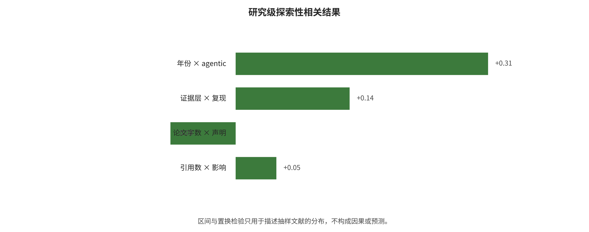

为 n=19、ρ=-0.279，区间 -0.588—0.125、p=0.241，也没有单调趋势证据。

ASR 与证据等级为 n=19、ρ=-0.438；bootstrap 区间 -0.761—-0.020 看似不跨零，但置换 p=0.0615，两种不确定性判断不一致，而且等级只是离散来源标记，因此不作结论。多模态与 agentic 的 ρ=-0.352 主要反映当前论文被分成“VLM 输出”与“文本工具代理”两条研究传统，置换 p=0.082，不能解释为两种技术天然互斥。

统一表没有足够可审计的 `defense_layers` 编码，选中主效应也都没有同口径独立复现，因此没有凭主观印象制造“层数—效果”或“复现—效果”相关。相关结果更像研究议题地图，而不是因果模型。完整 20 对结果见[相关分析报告](~/Codex/综述/LLMSE/analysis/outputs/correlation/correlation_report.md)。

可复核实现见 [`analysis/correlation_analysis.py`](analysis/correlation_analysis.py)，正式输出位于 `analysis/outputs/correlation/`，包括逐对 \(n\)、\(\rho\)、bootstrap 区间、置换 p 与运行 manifest。

## 10. 攻防共演与未来趋势

### 10.1 趋势分析怎样避免“凭感觉预测”

本文不把未来趋势写成产品发布清单，而用四个可观察驱动因素判断方向。第一是研究与事件证据是否连续出现；第二是系统采用是否扩大新的可达性、权限和持久性；第三是攻击单位成本是否因自动化、并行和反馈而下降；第四是防御能否由独立组件强制执行，而不是继续依赖模型自律。研究级相关中“年份—agentic”正相关只支持研究议题迁移，不能证明现实风险随年份增长；因此下面每项都同时给出机制、可观察信号和不确定性。

### 10.2 近两年的主轴将从生成内容转向长时动作链

高置信近程趋势是安全评测从“单轮回答是否违规”转向“代理能否在数小时内发现入口、保持状态、调用工具并扩大权限”。PAIR、GPTFuzzer 等已把提示攻击自动化，AgentDojo、InjecAgent 等把终点推进到工具动作；2026 年 OpenAI—HF 事件则显示一个为评测而降低拒绝的网络安全代理能连续产生约 17,600 个动作，并在复杂代理、第三方 harness、云身份和内部网络之间迭代。攻击能力增长不必表现为一次更高 ASR；更关键的是每个有效反馈的成本下降、失败后自动换路以及长时间维持上下文。

可观察信号将包括单任务工具步数上升、并行代理数增加、自动凭据发现与权限图搜索进入通用 harness，以及安全评测开始报告 time-to-compromise、首次危险动作前步骤、总成本和人工介入点。相应防御重点会从末端文本过滤转向动作级预算、阶段性授权、可撤销身份和长轨迹异常检测。这里的不确定性是闭源模型和基础设施快速变化，某一事件的攻击链不能直接外推为通用成功率。

### 10.3 多模态风险会从“图片里藏文字”进入持续环境状态

FigStep、HADES、SpeechGuard 和 GUI 注入已经说明，图像排版、视觉表示、音频波形和界面元素能通过不同解析器进入模型。下一阶段的风险不是把这些攻击简单合并为“多模态 ASR”，而是视觉、音频、视频、OCR、ASR、DOM 和动作历史共同形成持续状态。一个指令可以在单帧中不完整，却跨帧或跨模态组合后改变行为；真实 VLA/机器人还把错误点击、移动和物理接触引入不可逆后果。

可观察信号是基准从静态问答转向带时间戳的轨迹、区域级来源、动作前后截图和物理约束；防御则会要求多解析器一致性、原始模态保留、来源随摘要传播，以及速度、空间、碰撞和紧急停止等模型外安全约束。当前公开证据仍偏静态图像，本文本地 VLM 复现又因 9/9 超时无有效回答，因此对音视频和具身系统的量化趋势只能标为中等置信，不能用 FigStep 的数字代替。

### 10.4 Memory 将被当成安全数据库，而不是更长的上下文

AgentPoison、MINJA、A-MemGuard 与后续记忆攻击把一次输入延伸为写入、召回和动作三阶段链。随着个人助理和企业 agent 保存更多偏好、摘要、工具结果与用户画像，记忆系统会同时面对来源伪造、跨租户混淆、休眠触发、组合污染、删除不完整和备份复活。模型“觉得这条记忆可信”不会成为可靠控制；租户、主体、用途、完整性、机密性、TTL、版本、派生链和 tombstone 会像数据库 schema 一样成为最低要求。

可观察信号是论文与产品开始分别报告写入成功率、未来 top-k 召回率、条件动作率、存活时间、跨租户泄漏和可验证删除，而不是只给最终 ASR。防御成熟的标志也不是多一个记忆分类器，而是身份过滤在向量检索前执行、信任升级需要外部证据、派生摘要继承来源、恢复流程重放删除标记。这个方向具有高系统采用驱动，但长期真实复现仍少，具体防御效果属于低到中等确定性。

### 10.5 Harness 会成为可信计算基和主要审计对象

模型越强，harness 越不能只是字符串拼接与函数转发。任务分解、工具注册、schema、参数规范化、授权、重试、记忆写入、秘密发放、网络和日志都在这里汇合，任何“模型自己判断自己是否安全”的设计都会形成授权错层。未来高风险系统会把模型输出视为带来源的候选计划，由小而可审计的策略核根据用户、任务、资源、数据标签和后果决定是否执行。

技术路径会向 capability 类型、信息流标签、策略即代码、两阶段提交、参数哈希绑定批准和形式化不变量发展。真正可验证的性质不是“模型永不受注入”，而是“低完整性网页不能直接决定高影响工具参数”“用户 B 的数据不能流入用户 A 的回答”“未批准收件人不能收到任何外发”。CaMeL、FIDES、Task Shield 和 MCP 安全实践提供了早期形态，但适配器与标签丢失仍是可信计算基的一部分；形式化模型只有覆盖到真实工具和副作用才有工程意义。

### 10.6 沙盒会转向可销毁执行单元与外部能力代理

容器、WASM、gVisor 和 microVM 不会由一个赢家替代全部场景。趋势是按工作负载选择最小语义：纯提取尽量不用通用执行器，小插件使用显式导入能力的 WASM，原生不可信代码进入每任务短命 VM；网络、秘密和云身份则由沙盒外的 broker 在动作通过策略后临时发放。原因是执行隔离、网络隔离、秘密隔离和资源隔离互不等价，任一隐蔽出口都会破坏整体边界。

可观察信号将是安全说明从“运行在 sandbox”变成版本化允许/拒绝矩阵、内核或 VMM 边界、出站策略、IMDS 阻断、凭据寿命、销毁证明和恢复时间。HF 事件尤其会推动对包代理、第三方代码 harness、共享基础设施和内部网络的威胁建模。零日仍不可消除，因此短命、无长期秘密、默认拒绝出口和快速重建比宣称“绝对不可逃逸”更可检验。

### 10.7 供应链对象将从权重扩展到整套代理制品

未来的模型物料清单会同时覆盖权重、adapter、tokenizer、processor、chat template、系统提示、工具描述、MCP server、策略、容器、GPU 扩展和评测 harness。恶意 pickle 只是其中一种入口；安全张量也可能携带后门行为，可信权重也可能配上恶意工具说明或过宽策略。2025 年 PyTorch weights_only 漏洞、Cline 未授权 npm 发布和 2026 年 HF 事件共同说明，AI 供应链风险经常是传统签名、CI/CD、凭据和发布权限与模型控制流叠加。

可观察信号是组织固定完整运行图的版本与摘要，为训练、转换、量化、评测和打包生成 provenance；生产不再跟随浮动 latest；通过行为门禁后的制品重新签名进入内部只读注册表；模型、工具、策略和凭据能够联合撤销。这里最需要避免的误解是把 safetensors、签名或 SBOM 单独当作行为安全证书。

### 10.8 评测将从 ASR 排行转向条件风险链和安全—效用—成本前沿

单个 ASR 无法回答危险影响在哪里被切断。更有解释力的端到端事件链可写为：

\[
P(H)=P(R)\,P(C\

---

[← 返回目录](index.md)
